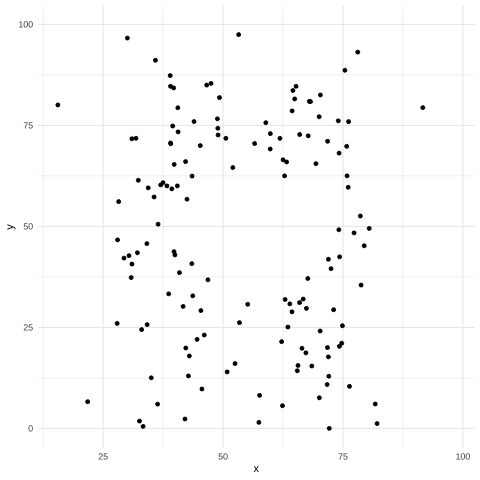

```{r setup}
library(tidyverse)
library(lubridate)
library(knitr)
library(DT)

knitr::opts_chunk$set( echo      = TRUE,
                       message   = FALSE,
                       error     = FALSE,
                       fig.align ="center",
                       out.width="100%")


options( "kableExtra.html.bsTable" = TRUE,
         digits=3 )
```


## Loading in the libraries

The *meta library* that contains `ggplot2` (plus a bunch more) is found in the `tidyverse` library.


```{r message=FALSE}
library( tidyverse )
```


```{r}
data(airquality)
summary(airquality)
```


```{r}
airquality %>%
  mutate( Month = factor( Month, ordered = TRUE), 
          Day = factor( Day, ordered = TRUE ) ) -> airquality
summary( airquality)
```


## Components


```{r eval=FALSE}
ggplot()  +  geom_XXXXX()   +  geom_YYYY() + coord_XXXX() + stat_XXXX()  + theme_XXX()
```


## Aesthetic Mapping

```{r}
aes( x = Temp, y = Wind )
```


## Univariate Plots

```{r}
ggplot( airquality, aes( Wind ) ) + geom_histogram()
```


```{r}
ggplot( airquality, aes( Wind ) ) + geom_histogram( binwidth=0.5 )
```


```{r}
ggplot( airquality, aes( Wind ) ) + geom_area( stat="bin", binwidth=1)
```

```{r}
ggplot( airquality, aes( Wind ) ) + geom_dotplot( binwidth = 0.5 )
```


```{r}
ggplot( airquality, aes( Wind ) ) + geom_freqpoly( binwidth = 1.0 )
```


```{r}
ggplot( airquality, aes( sample=Wind ) ) + geom_qq()
```


```{r}
ggplot( airquality, aes( sample=Wind ) ) + geom_qq() + geom_qq_line( color="red")
```


## Bivariate Data 


### Continuous ~ Discrete


```{r}
ggplot( airquality, aes(x=Month, y=Wind) ) + geom_col()
```


```{r}
ggplot( airquality, aes(x=Wind) ) + geom_bar()
```


```{r}
ggplot( airquality, aes(x=Month, y=Wind) ) + geom_boxplot()
```


```{r}
ggplot( airquality, aes(x=Month, y=Wind) ) + geom_boxplot(notch=TRUE)
```


```{r}
ggplot( airquality, aes(x=Month, y=Wind) ) + geom_violin() 
```


```{r}
ggplot( airquality, aes( x = Month, y = Wind) ) + geom_point() 
```


```{r}
ggplot( airquality, aes( x = Month, y = Wind) ) + geom_point(alpha=0.25) 
```


### Getting Jigggy


```{r}
ggplot( airquality, aes( x = Month, y = Wind) ) + geom_point(alpha=0.25) + 
  geom_jitter( shape=2, width=0.2) 
```


### Continuous ~ Continuous


```{r}
ggplot( airquality, aes( x = Temp, y = Wind) ) + geom_point()
```


```{r eval=FALSE}
ggplot( airquality, aes( x = Temp, y = Wind) ) + geom_point()
ggplot() + geom_point( aes( x = Temp, y = Wind ), data = airquality )
ggplot( airquality ) + geom_point( aes( x = Temp, y = Wind ) )
ggplot( aes( x = Temp, y = Wind ) ) + geom_point( data = airquality )
```


```{r}
ggplot( airquality, aes( x = Temp, y = Wind) ) + geom_point(alpha=0.25) + 
  geom_quantile()
```


```{r}
ggplot( airquality, aes( x = Temp, y = Wind) ) + geom_point() + 
  geom_smooth()
```


```{r}
ggplot( airquality, aes( x = Temp, y = Wind) ) + geom_point() + 
  geom_rug()
```

```{r}
airquality %>% 
  filter( Wind > 20 ) %>% 
  mutate( Label = "Kite Flying") -> kite.days
kite.days
```


```{r}
ggplot( airquality, aes( x = Temp, y = Wind) ) + 
  geom_point()  + 
  geom_label( aes(label=Label), data = kite.days, position="nudge")
```


```{r}
ggplot( airquality, aes( x = Temp, y = Wind) ) + geom_density2d()
```


```{r}
ggplot( airquality, aes( x = Temp, y = Wind) ) + geom_hex()
```


### Continuous ~ Continuous ~ Continuous

```{r}
ggplot( airquality, aes( x=Month, y=Day, z = Wind) ) + geom_contour()
```

```{r}
# geom_tile() & geom_raster() make the same output
ggplot( airquality, aes( x=Month, y=Day, fill = Wind) ) + 
  geom_tile() + coord_equal()
```


```{r}
p <- ggplot( airquality, aes( x=Month, y=Day, fill = Wind) ) + 
  geom_tile() + coord_equal()
p + scale_fill_distiller( palette = "Greens")
```

```{r}
p + scale_fill_gradient( low="black", high="gold")
```


```{r}
p + scale_fill_gradient2( low="red", mid="white", high="green", midpoint = 10)
```


```{r eval=FALSE}
library(rgl)
open3d()
plot3d( airquality$Ozone, airquality$Wind, airquality$Temp, col="red")
for(i in seq(0,360) ) {
  view3d(theta=i)
}
```


```{r eval=FALSE}
library(datasauRus)
library(ggplot2)
library(gganimate)
library(gifski)

ggplot(datasaurus_dozen, aes(x=x, y=y))+
  geom_point()+
  theme_minimal() +
  transition_states(dataset, 3, 1) + 
  ease_aes('cubic-in-out')
gifski( list.files(pattern="gganim_plot*"), delay = 0.25)
```




## Partitions


```{r}
ggplot( airquality, aes(Wind, fill=Month) ) + 
  geom_histogram(position="dodge", binwidth=4)
```


```{r}
ggplot( airquality, aes(Wind, fill=Month) ) + 
  geom_density( alpha=0.5 )
```


```{r}
ggplot( airquality, aes(Wind)) + 
  geom_histogram( binwidth=1.0) + 
  facet_grid( Month ~ .) 
```


```{r}
ggplot( airquality, aes(Wind, Temp)) + 
  geom_point() + 
  facet_grid( . ~ Day) 
```

```{r}
ggplot( airquality, aes(Wind,Temp)) + 
  geom_point() + 
  facet_grid( Month ~ Day) 
```

```{r}

```


## Transformations


```{r}
ggplot( airquality, aes( x = Wind, y = Temp ) ) +
  geom_point() + 
  coord_flip()
```


```{r}
ggplot( airquality, aes( x = Wind, y = Temp ) ) +
  geom_point() + 
  coord_fixed()
```


```{r}
df <- data.frame( x = 0:25, y = 0:25, shape = factor(0:25) )
ggplot( df, aes( x = x, y = y, shape= shape ) ) + geom_point(size=4) + scale_shape_manual( values=0:25)
```


```{r}
ggplot( airquality, aes( x = Wind, y = Temp, shape=factor(Month) ) ) +
  geom_point() + coord_fixed() -> p

p + scale_shape_manual( values=21:25 )
```


```{r}
ggplot( airquality, aes( x = Wind, y = Temp ) ) +
  geom_point() + 
  ylim( c(70,80) ) + xlim( c(10,15) )
```


```{r}
ggplot( airquality, aes( x = Wind, y = Temp ) ) +
  geom_point() + 
  scale_x_reverse()
```


```{r}
ggplot( airquality, aes( x = Wind, y = Temp ) ) +
  geom_point() + 
  scale_y_log10() + 
  scale_x_sqrt()
```

```{r}
library(GGally)
airquality %>%
  select( Ozone, Solar.R, Wind, Temp ) %>%
  ggpairs()
```


## Themes & Decorations

```{r}
ggplot( airquality, aes(Temp, Wind)) + geom_point() +
  ylab("Windspeed") + 
  xlab("Temperate (F for some reason)") +
  ggtitle("This is the title of the Graph")
```


```{r}
ggplot( airquality, aes(Temp, Wind, color=Month)) + geom_point() +
  ylab("Windspeed") + 
  xlab("Temperate (F)") 
```


```{r}
ggplot( airquality, aes(Temp, Wind, shape=Month)) + geom_point() +
  ylab("Windspeed") + 
  xlab("Temperate (F)") 
```


```{r}
ggplot( airquality, aes(Wind, Temp)) + geom_point()  + 
  theme_bw()
```


```{r}
ggplot( airquality, aes(Wind, Temp)) + geom_point()  + 
  theme_dark()
```

```{r}
ggplot( airquality, aes(Wind, Temp)) + geom_point()  + 
  theme_light()
```

```{r}
ggplot( airquality, aes(Wind, Temp)) + geom_point()  + 
  theme_classic()
```

```{r}
ggplot( airquality, aes(Wind, Temp)) + geom_point()  + 
  theme_void()
```


```{r eval=FALSE}
scale = 4.5
USArrests %>%
  ggplot( aes(UrbanPop, Murder) ) + 
  stat_smooth( linetype=2, col="red", fill="#dddddd", formula = y~x, method=lm, size=.5) +
  geom_point( size = 2 ) + 
  theme_minimal()  + 
  labs( x = "Population", 
        y = "Assults", 
        title = "US Arrests (1973)" ) +
  theme(
     text = element_text(family = "docktrin", size = 16*scale), 
     plot.title = element_text(size = 10*scale, hjust = 0.5),
     panel.grid = element_line(color = "black"),
     axis.text.x = element_text( size = 3*scale),
     axis.text.y = element_text( size = 3*scale ),
     legend.text = element_text( size = scale ),
     axis.title = element_text(size = 10*scale),
     axis.text = element_text(color = "black"))

```


